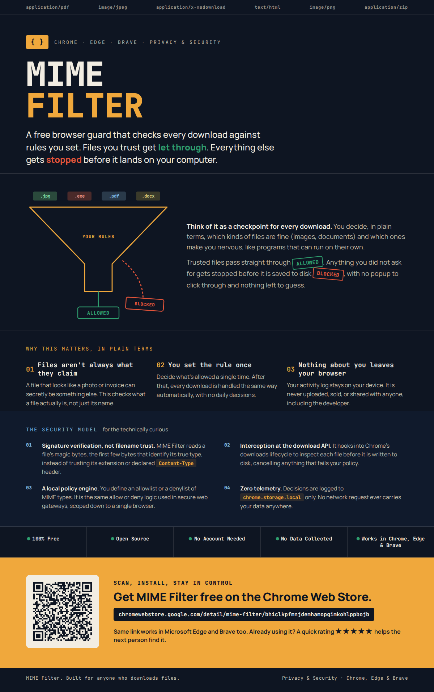

# MIME Filter Browser Extension

<p align="center">
  
</p>
<p align="center" style="margin-top:-90px"><em>Block what doesn't belong. Allow what does.</em></p>

<p align="center">
  <a href="https://chromewebstore.google.com/detail/mime-filter/bhiclkpfmnjdemhamopgimkohlppbojb">
    
  </a>
  <a href="https://chromewebstore.google.com/detail/mime-filter/bhiclkpfmnjdemhamopgimkohlppbojb">
    
  </a>
  <a href="https://chromewebstore.google.com/detail/mime-filter/bhiclkpfmnjdemhamopgimkohlppbojb">
    
  </a>
  <a href="https://github.com/macbuildssys/mime-filter/releases">
    
  </a>
  <a href="https://github.com/macbuildssys/mime-filter/releases">
    
  </a>
  <a href="https://github.com/macbuildssys/mime-filter/releases">
    
  </a>
  
</p>

A cross-browser extension for **Chrome**, **Microsoft Edge**, **Brave**, **Firefox**, **LibreWolf**, and **Tor** that intercepts browser downloads and blocks or permits them based on user-defined MIME type rules.

**MIME Filter is now live on the Chrome Web Store** → [Get it here](https://chromewebstore.google.com/detail/mime-filter/bhiclkpfmnjdemhamopgimkohlppbojb). No developer mode, no manual loading, just install and go. If you're already using it, a quick rating on the store page helps other people find it.

## Installation

### Google Chrome (Chrome Web Store)

1. Visit the [Chrome Web Store listing](https://chromewebstore.google.com/detail/mime-filter/bhiclkpfmnjdemhamopgimkohlppbojb).
2. Click **Add to Chrome**.
3. The ⬡ icon appears in the toolbar. Done.

### Microsoft Edge (from the Chrome Web Store)

1. Visit the [Chrome Web Store listing](https://chromewebstore.google.com/detail/mime-filter/bhiclkpfmnjdemhamopgimkohlppbojb) in Edge.
2. Click **Add to Chrome**. Edge will prompt you to confirm installing an extension from another store, click **Allow extension from other stores** (or enable it once in `edge://extensions` if you don't see the prompt).
3. Click **Add extension** to confirm.
4. The ⬡ icon appears in the toolbar.

### Brave (from the Chrome Web Store)

1. Visit the [Chrome Web Store listing](https://chromewebstore.google.com/detail/mime-filter/bhiclkpfmnjdemhamopgimkohlppbojb) in Brave.
2. Click **Add to Chrome**, then **Add extension** to confirm. Brave installs it straight from the Chrome Web Store, no extra toggle needed.
3. The ⬡ icon appears in the toolbar.

### Firefox/LibreWolf/Tor (signed .xpi - permanent install)

1. Download the latest `.xpi` file from the [Releases](https://github.com/macbuildssys/mime-filter/releases) page.
2. Open Firefox and go to `about:addons`.
3. Click the gear icon ⚙️ → **Install Add-on From File…**
4. Select the downloaded `.xpi` file.
5. Click **Add** when prompted.

The extension will persist across Firefox restarts and update when you install a newer `.xpi`.

For LibreWolf and Tor, the steps are identical, the signed `.xpi` works without any config changes.

### Firefox/LibreWolf/Tor (temporary install)

1. Open `about:debugging#/runtime/this-firefox`.
2. Click **Load Temporary Add-on** → select `manifest.json` inside `mime-filter/`.
3. The extension is active until Firefox restarts.


## Usage

### Enable/Disable

The **ON/OFF** toggle in the header enables or disables all download filtering. Settings and logs are preserved while disabled.

### Mode

| Mode        | Behaviour |
|-------------|-----------|
| **Allowlist** | Only MIME types matching a rule are permitted. Everything else is blocked. |
| **Denylist**  | MIME types matching a rule are blocked. Everything else passes through. |

### Adding Rules

1. Type a MIME type or prefix into the input field and press **Enter** or click **＋**.
2. Or click a **Quick add** tag for common types.

Rules are **prefix-matched** (case-insensitive), mirroring the `strncasecmp` logic from `SAutotransferMime.cxx`:

| Rule entered       | Matches |
|--------------------|---------|
| `application/pdf`  | Exactly `application/pdf` |
| `image/`           | `image/png`, `image/jpeg`, `image/webp`, … |
| `text/`            | `text/plain`, `text/html`, `text/csv`, … |
| `application/vnd.openxmlformats-officedocument.` | All modern Office formats |

### Log

The **Log** tab shows all intercepted downloads, newest first. Each entry records:

- Status: `blocked` or `allowed`
- MIME type detected by the browser
- Source URL
- Timestamp

Click **Export JSON** to download the full log as a `.json` file.

## Sample MIME Type Rules

### Allowlist (office + documents)

```
application/pdf
image/
text/plain
text/csv
application/json
application/zip
application/vnd.openxmlformats-officedocument.
application/vnd.oasis.opendocument.
application/pkcs12
audio/
video/
```

### Denylist (block executables)

```
application/x-msdownload
application/x-executable
application/x-sh
application/x-bat
application/x-msi
application/octet-stream
```

## Sample Log Output (JSON)

```json
[
  {
    "id": "42",
    "url": "https://example.com/report.pdf",
    "filename": "report.pdf",
    "mimeType": "application/pdf",
    "status": "allowed",
    "reason": "MIME type \"application/pdf\" matched allowlist rule",
    "timestamp": "2026-03-11T09:14:22.801Z"
  },
  {
    "id": "43",
    "url": "https://evil.example.com/payload.exe",
    "filename": "payload.exe",
    "mimeType": "application/x-msdownload",
    "status": "blocked",
    "reason": "MIME type \"application/x-msdownload\" is not in the allowlist",
    "timestamp": "2026-03-11T09:15:03.412Z"
  }
]
```

### MIME Matching Flow (background.js)

```
chrome.downloads.onCreated
        │
        ▼
  filtering enabled? ──No──▶ pass through
        │ Yes
        ▼
  extract downloadItem.mime
        │
        ▼
  matchesMimeRule(mime, rules)
  (prefix-matched, case-insensitive)
        │
   ┌────┴────┐
   │         │
Allowlist  Denylist
   │         │
match=allow  match=block
no match=block  no match=allow
        │
        ▼
  Block: cancel() → erase() → notify() → log(blocked)
  Allow: log(allowed)
```

## Browser Compatibility

| Feature | Chrome MV3 | Microsoft Edge MV3 | Brave MV3 | Firefox MV3 | LibreWolf/Tor |
|---------|-----------|---------------------|-----------|-------------|-----------|
| Download interception | ✅ | ✅ | ✅ | ✅ | ✅ |
| Cancel download | ✅ | ✅ | ✅ | ✅ | ✅ |
| Notifications | ✅ | ✅ | ✅ | ✅ | ✅ |
| Persistent storage | ✅ | ✅ | ✅ | ✅ | ✅ |
| Service worker | ✅ | ✅ | ✅ | ✅ (109+) | ✅ |

> **Note:** Firefox requires the `browser_specific_settings.gecko.id` field in `manifest.json`; this is already included.

## License

Distributed under the MIT License. See [LICENSE](LICENSE).


## Chrome Web Store poster

<p align="center">
  
</p>