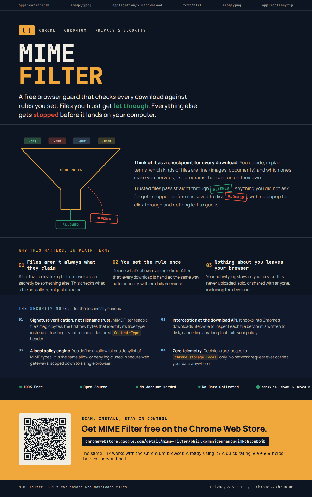

# MIME Filter Browser Extension

<p align="center">
  
</p>
<p align="center" style="margin-top:-90px"><em>Block what doesn't belong. Allow what does.</em></p>

<p align="center">
  
  <p align="center">
  <a href="https://chromewebstore.google.com/detail/mime-filter/bhiclkpfmnjdemhamopgimkohlppbojb">
    
  </a>
  <a href="https://chromewebstore.google.com/detail/mime-filter/bhiclkpfmnjdemhamopgimkohlppbojb">
    
  </a>
  <a href="https://github.com/macbuildssys/mime-filter/releases">
    
  </a>
  <a href="https://github.com/macbuildssys/mime-filter/releases">
    
  </a>
  <a href="https://github.com/macbuildssys/mime-filter/releases">
    
  </a>
  
</p>

A cross-browser extension for **Chrome**, **Chromium**, **Firefox**, **LibreWolf**, and **Tor** that intercepts browser downloads and blocks or permits them based on user-defined MIME type rules.

## Installation

### Google Chrome/Chromium (Chrome Web Store)

1. Visit the [Chrome Web Store listing](https://chromewebstore.google.com/detail/mime-filter/bhiclkpfmnjdemhamopgimkohlppbojb).
2. Click **Add to Chrome**.
3. The ⬡ icon appears in the toolbar. Done.

### Firefox/LibreWolf/Tor (signed .xpi - permanent install)

1. Download the latest `.xpi` file from the [Releases](https://github.com/macbuildssys/mime-filter/releases) page.
2. Open Firefox and go to `about:addons`.
3. Click the gear icon ⚙️ → **Install Add-on From File…**
4. Select the downloaded `.xpi` file.
5. Click **Add** when prompted.

The extension will persist across Firefox restarts and update when you install a newer `.xpi`.

For LibreWolf and Tor, the steps are identical, the signed `.xpi` works without any config changes.

## Usage

### Enable/Disable

The **ON/OFF** toggle in the header enables or disables all download filtering. Settings and logs are preserved while disabled.

### Mode

| Mode        | Behaviour |
|-------------|-----------|
| **Allowlist** | Only MIME types matching a rule are permitted. Everything else is blocked. |
| **Denylist**  | MIME types matching a rule are blocked. Everything else passes through. |

### Adding Rules

1. Type a MIME type or prefix into the input field and press **Enter** or click **＋**.
2. Or click a **Quick add** tag for common types.

Rules are **prefix-matched** (case-insensitive):

| Rule entered       | Matches |
|--------------------|---------|
| `application/pdf`  | Exactly `application/pdf` |
| `image/`           | `image/png`, `image/jpeg`, `image/webp`, … |
| `text/`            | `text/plain`, `text/html`, `text/csv`, … |

### Docs only

A single switch, separate from Allowlist/Denylist, on its own tab. It only ever *adds* an allowance, it never blocks anything on its own. When it's on, a fixed set of document types is always allowed, no matter what the current Allowlist or Denylist says: PDF, RTF, CSV/TSV, Markdown, XML, EPUB/Mobipocket, and Office, OpenDocument, and Apple iWork formats (old and new, including macro-enabled and template variants). Plain text (`text/plain`) is deliberately left out, since Python, Java, JavaScript and other languages' scripts often reports as plain text.

Anything that isn't a document is decided exactly as if Docs only were off, by the normal Allowlist/Denylist or a website rule.

On the Rules tab, while Docs only is on, document-type entries show up **locked**: they can't be removed, and new ones can't be added, typed in, or picked from the search dropdown, in either list. Turning Docs only off restores the Allowlist/Denylist exactly as they were before it was turned on.

### Websites

Trust or block downloads from a specific website, overriding the general Allowlist/Denylist (and Docs only) for that site. Add a host (e.g. `example.com`) and choose:

| Action | Behaviour |
|--------|-----------|
| **Trust** | Any file type is allowed from this site. |
| **Block** | Every download from this site is blocked. |
| **Only types** | Only the MIME types you list are allowed from this site. |

A rule for `example.com` also covers its subdomains, and the most specific host wins if more than one matches. It's checked against the download's own URL, its final URL after redirects, and the page that started the download, so trusting a download page still works even if it hands off to a different mirror to serve the actual file. A website rule always takes priority over Docs only and the Allowlist/Denylist.

### Log

The **Log** tab shows all intercepted downloads, newest first, filterable by status (`All`, `Blocked`, `Warned`, `Allowed`). Each entry records:

- Status: `blocked`, `warned`, or `allowed`
- MIME type detected by the browser
- Source URL
- Website rule matched, if any
- Timestamp

Click **JSON** to export the full log, or **CSV** to export just the entries currently shown by the status filter, as a spreadsheet-ready `.csv` file.

## Sample MIME Type Rules

### Allowlist (office + documents)

```
application/pdf
image/
text/plain
text/csv
application/json
application/zip
application/vnd.openxmlformats-officedocument.
application/vnd.oasis.opendocument.
application/pkcs12
audio/
video/
```

### Denylist (block executables)

```
application/x-msdownload
application/x-executable
application/x-sh
application/x-bat
application/x-msi
application/octet-stream
```

## Sample Log Output

### JSON

```
[
  {
    "id": "42",
    "url": "https://example.com/report.pdf",
    "filename": "report.pdf",
    "mimeType": "application/pdf",
    "status": "allowed",
    "reason": "MIME type \"application/pdf\" matched allowlist rule",
    "timestamp": "2026-03-11T09:14:22.801Z",
    "siteRule": "none",
    "siteHost": ""
  },
  {
    "id": "43",
    "url": "https://evil.example.com/payload.exe",
    "filename": "payload.exe",
    "mimeType": "application/x-msdownload",
    "status": "blocked",
    "reason": "MIME type \"application/x-msdownload\" is not in the allowlist",
    "timestamp": "2026-03-11T09:15:03.412Z",
    "siteRule": "none",
    "siteHost": ""
  },
  {
    "id": "44",
    "url": "https://mirror.example.net/linux.iso",
    "filename": "linux.iso",
    "mimeType": "application/x-iso9660-image",
    "status": "allowed",
    "reason": "Trusted site rule for example.com: any type allowed",
    "timestamp": "2026-03-11T09:16:47.203Z",
    "siteRule": "trust",
    "siteHost": "example.com"
  }
]
```

### CSV

```
timestamp,status,mimeType,siteRule,siteHost,filename,url,reason,id
"2026-03-11T09:14:22.801Z","allowed","application/pdf","none","","report.pdf","https://example.com/report.pdf","MIME type ""application/pdf"" matched allowlist rule","42"
"2026-03-11T09:15:03.412Z","blocked","application/x-msdownload","none","","payload.exe","https://evil.example.com/payload.exe","MIME type ""application/x-msdownload"" is not in the allowlist","43"
"2026-03-11T09:16:47.203Z","allowed","application/x-iso9660-image","trust","example.com","linux.iso","https://mirror.example.net/linux.iso","Trusted site rule for example.com: any type allowed","44"
```

### MIME Matching Flow (background.js)

```
chrome.downloads.onCreated
        │
        ▼
  filtering enabled? ──No──▶ pass through
        │ Yes
        ▼
  extract downloadItem.mime
        │
        ▼
  matchesMimeRule(mime, rules)
  (prefix-matched, case-insensitive)
        │
   ┌────┴────┐
   │         │
Allowlist  Denylist
   │         │
match=allow  match=block
no match=block  no match=allow
        │
        ▼
  Block: cancel() → erase() → notify() → log(blocked)
  Allow: log(allowed)
```

## Browser Compatibility

| Feature | Chrome MV3 | Firefox MV3 | LibreWolf/Tor |
|---------|-----------|-------------|-----------|
| Download interception | ✅ | ✅ | ✅ |
| Cancel download | ✅ | ✅ | ✅ |
| Notifications | ✅ | ✅ | ✅ |
| Persistent storage | ✅ | ✅ | ✅ |
| Service worker | ✅ | ✅ (109+) | ✅ |

> **Note:** Firefox requires the `browser_specific_settings.gecko.id` field in `manifest.json`; this is already included.

## License

Distributed under the MIT License. See [LICENSE](LICENSE).


## Chrome Web Store poster

<p align="center">
  
</p>